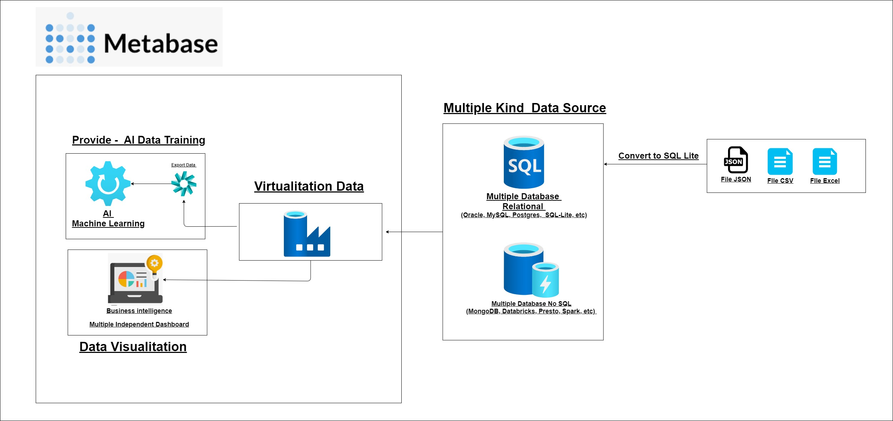

# Metabase: Your BI Solution for Data Management and AI Readiness

In today's digital world, businesses create a huge amount of data. But raw data is often useless unless it's properly organized and presented. This is where **data visualization** and **data virtualization** become essential.



#### Why Data Visualization is Important

Data visualization turns raw data into simple graphics like charts and graphs. Its main goal is to help people understand and find hidden patterns and trends. Our brains process visuals much faster than text, so data visualization helps teams:

* **Quickly identify trends** and behavioral patterns.
* **Tell a data story** to people who aren't technical.
* **Speed up analysis** and decision-making.

#### Why Data Virtualization is Important

Company data is often scattered across many places, like local databases and cloud services. **Data virtualization** creates a single layer that connects all this data without having to copy it. This provides several benefits:

* **Unified data access** from one single location.
* **Flexibility and efficiency** by avoiding data duplication.
* **Less reliance on IT teams** for complex data integration.

In short, data visualization and virtualization are **fundamental needs** for modern organizations. They work together to turn scattered data into a strategic resource that drives growth and innovation.

# Table of Contents
1.  **Getting to Know Metabase**
    * What is Metabase?
    * Benefits of Metabase for Data Analysis and Visualization
        * Powerful Data Visualization
        * Self-Service BI
        * Interactive Dashboard Creation
        * Data Models and Virtualization

2.  **Metabase Architecture and Deployment with Docker**
    * Metabase Deployment with Docker
    * System Architecture
    * List Support Connection Database 
    * Deployment Guide
        * Step 1: Connecting Metabase to Your Database
        * Step 2: Exploring Your Database Structure
        * Step 3: Creating Dashboards and Visualizations

3.  **Exporting Data for AI Purposes**
    * Data Export Process
    * Benefits for AI Training

## 1. What is Metabase?


Metabase is an **open-source Business Intelligence (BI) tool** designed to transform raw data into valuable business insights. It's built for ease of use, allowing anyone in an organization, from analysts to managers, to ask questions about data and see the answers in a clear, visual format. Metabase acts as a **bridge between complex databases and business teams**, enabling data-driven decisions in real time.

Metabase supports various databases like MySQL, PostgreSQL, SQL Server, Mongodb, Spark SQL, Presto and more. It can be deployed in different environments, including local servers, the cloud, or with Docker, making it flexible and easy to implement.

## 2. Metabase Architecture and Deployment with Docker

Metabase is more than just a visualization tool; it's a comprehensive platform for data exploration. Here are some of its key benefits:

* **Powerful Data Visualization**: Metabase turns confusing data tables into informative charts, graphs, and maps. With its **"Questions"** feature, you can create visualizations with just a few clicks, without writing any SQL code.
* **Self-Service BI**: Metabase empowers non-technical users to explore data on their own. They can build simple or complex queries using the intuitive **"Query Builder"**. This reduces the dependence on IT teams, speeding up decision-making.
* **Interactive Dashboards**: You can combine multiple relevant visualizations into a single, dynamic **dashboard**. Dashboards are perfect for monitoring Key Performance Indicators (KPIs) and sharing reports.
* **Data Models and Virtualization**: This feature helps simplify complex database structures. You can create **"Models"** that act as an abstraction layer over your database tables, making the data easier to understand for all users.


### 2.1 Metabase Deployment with Docker

Using Docker is the most efficient and recommended way to run Metabase. Here is a step-by-step guide to deploy it and connect to your database.


for deploy just run docker compose for metabase, file deployment was provide in this repostiory is **docker-compose.yaml** 

```docker-compose up -d```

### 2.2. System Architecture

A typical Metabase architecture uses two connected Docker containers:
1.  **Metabase Application Container (`metabase_app`)**: This container runs the Metabase web application.
2.  **Metabase Database Container (`metabase_postgres`)**: This container stores Metabase's internal metadata, like dashboards and user settings.
You can see both containers running smoothly.

### 2.3 List Metabase Database Connection Support


Metabase supports a wide range of databases, both relational and NoSQL, to make data analysis and connection simple. Here is a list of the officially supported database types:

* **Relational Databases**:
    * PostgreSQL
    * MySQL
    * MariaDB
    * SQL Server
    * Oracle
    * SQLite

* **Data Warehouses**:
    * Amazon Redshift
    * Google BigQuery
    * Snowflake
    * Vertica
    * Presto
    * SparkSQL

* **NoSQL & Other Data Sources**:
    * MongoDB
    * Druid
    * Amazon Athena
    * Google Sheets
    * CSV files (via upload)
    * Databricks

With this broad support, Metabase can easily integrate into a wide variety of existing data infrastructures within any organization.

### 2.4. Deployment Guide

**2.4.1 Step 1: Connect to Your Database**

After Metabase is running, the next step is to connect it to your database.
* On the Metabase homepage, click **Add data**.      
* Fill in your database connection details and click **Save**.
* If the connection is successful, you will see a **Connected** status.

**This is Step Conection database part 1 :**


   
**This is Step Conection database part 2 :**


**This is Step Conection database part 3 :**
     


**This is Step Conection database part 4 :**
     


**This is Step Conection database part 5 :**
      


**2.4.2 Step 2: Explore Your Database Structure**

Once connected, you can start exploring your data.
* On the **"Databases"** page, you'll see your newly added database.       
* Click on it to see a list of all your tables.
* You can click on any table to see its columns and data.
        


**2.4.3 Step 3: Create Dashboards and Visualizations**

Now that your data is ready, you can create dashboards to monitor your business metrics.
* Click **"+ New"** in the top-right corner and select **"Dashboard"**.       
* Give your dashboard a name, like **"My Dashboard Sales"**.       
* You can now add questions or visualizations you have already created to this dashboard.
        
**This is Step Create Dashboards and Visualizations part 1 :**


**This is Step Create Dashboards and Visualizations part 2 :**


**This is Step Create Dashboards and Visualizations part 3 :**


**This is Step Create Dashboards and Visualizations part 4 :**


**This is Step Create Dashboards and Visualizations part 5 :**


**This is Step Create Dashboards and Visualizations part 6 :**


**This is Step Create Dashboards and Visualizations part 7 :**


**This is Step Create Dashboards and Visualizations part 8 :**


## 3.1 Exporting Data for AI Training

One of Metabase's great benefits is its ability to **easily export data**. The visualizations you create in Metabase can serve as the basis for more advanced data analysis, including training Machine Learning or AI models.

* **How to Export Data**:
    Any visualization or "Question" you create can be downloaded in formats like **CSV**, **XLSX**, or **JSON**. You'll find the export option directly on the results page of your visualization.

* **Benefits for AI Training**:
    * **Clean Datasets**: Metabase allows you to create complex queries and clean your data before exporting. These clean, structured datasets are ideal for **feature engineering and training AI models**.
    * **Exploratory Data Analysis (EDA)**: Before training a model, you can use Metabase to perform EDA. Visualizing trends, correlations, and data distribution gives you valuable insights that can guide your AI model development.
